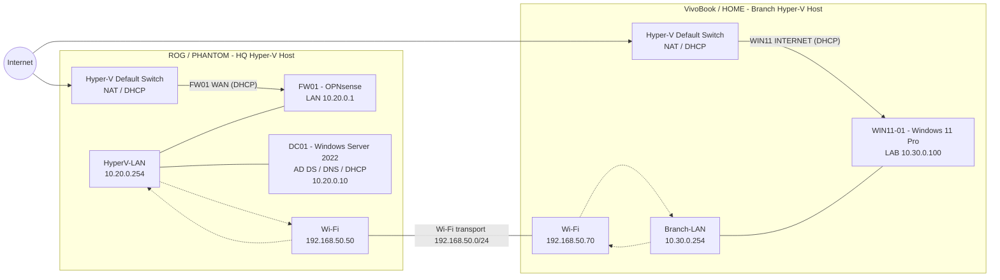

# Enterprise Network Support Lab

> Hands-on enterprise infrastructure lab for practicing network support, Windows administration, Active Directory, routing, firewalling, and structured troubleshooting.

Built with **Microsoft Hyper-V**, **OPNsense**, **Windows Server 2022**, and **Windows 11 Pro**, the lab spans two physical Hyper-V hosts and two routed lab subnets.

## Architecture Overview



The physical Wi-Fi network is used as the **Layer 3 transport** between the two Hyper-V hosts. The HQ and Branch networks remain separate routed subnets.

There is currently **no NAT between `10.20.0.0/24` and `10.30.0.0/24`** and **no site-to-site VPN**. A VPN implementation is planned for a later lab phase.

## Infrastructure

| System | Role | Addressing |
| --- | --- | --- |
| **FW01** | OPNsense firewall / router | LAN `10.20.0.1` |
| **DC01** | AD DS / DNS / DHCP | `10.20.0.10` |
| **ROG / PHANTOM** | HQ Hyper-V host / software router | `10.20.0.254`, `192.168.50.50` |
| **VivoBook / HOME** | Branch Hyper-V host / software router | `192.168.50.70`, `10.30.0.254` |
| **WIN11-01** | Windows 11 Pro domain workstation | LAB `10.30.0.100` |

### Network Segments

| Network | Purpose |
| --- | --- |
| `10.20.0.0/24` | HQ / core lab |
| `10.30.0.0/24` | Branch lab |
| `192.168.50.0/24` | Physical Wi-Fi transport between Hyper-V hosts |

## Active Directory Environment

- **DNS domain:** `corp.lab.node`
- **NetBIOS domain:** `CORP`
- **Domain controller:** `DC01.corp.lab.node`
- **Domain client:** `WIN11-01.corp.lab.node`

DC01 provides **Active Directory Domain Services, DNS, DHCP, and Group Policy infrastructure**.

WIN11-01 is joined to the domain and its secure channel, DNS resolution, and LDAP connectivity have been verified.

## Key Design Decisions

- The HQ and Branch networks are routed rather than bridged.
- The home Wi-Fi network is used only as the transport underlay between the two Hyper-V hosts.
- Windows IPv4 forwarding is enabled on the required ROG and VivoBook interfaces.
- Static routes provide bidirectional reachability between `10.20.0.0/24` and `10.30.0.0/24`.
- WIN11-01 is dual-homed: **LAB** carries enterprise lab traffic, while **INTERNET** uses the Hyper-V Default Switch.
- WIN11-01's LAB adapter has no default gateway; explicit routes keep AD and lab traffic on the intended path.
- FW01 uses `ROG_LAB_GW` (`10.20.0.254`) as the next hop for Branch-LAN.
- Diagnostic firewall rules are intentionally narrow and limited to the traffic required for validation.

## Verified Capabilities

| Capability | Status |
| --- | :---: |
| Hyper-V multi-host lab | ✅ |
| OPNsense firewall / routing | ✅ |
| Active Directory Domain Services | ✅ |
| Internal DNS | ✅ |
| DHCP on HQ subnet | ✅ |
| Windows 11 domain join | ✅ |
| HQ ↔ Branch routed connectivity | ✅ |
| Windows Firewall troubleshooting | ✅ |
| OPNsense aliases and firewall rules | ✅ |
| DNS resolution from WIN11-01 | ✅ |
| LDAP TCP/389 to DC01 | ✅ |
| Domain secure channel | ✅ |
| Internet connectivity from WIN11-01 | ✅ |
| Multi-hop traceroute validation | ✅ |

### Verified Routing Paths

WIN11-01 to the HQ network:

```text
WIN11-01 10.30.0.100
  -> VivoBook Branch-LAN 10.30.0.254
  -> ROG Wi-Fi 192.168.50.50
  -> HQ 10.20.0.0/24
```

DC01 to WIN11-01:

```text
DC01 10.20.0.10
  -> ROG HyperV-LAN 10.20.0.254
  -> VivoBook Wi-Fi 192.168.50.70
  -> WIN11-01 10.30.0.100
```

## Documentation

Detailed build notes, addressing, routing, and validation are maintained under `docs/`.

| Area | Document |
| --- | --- |
| Architecture | [`docs/architecture/network-topology.md`](docs/architecture/network-topology.md) |
| IP addressing | [`docs/architecture/ip-addressing.md`](docs/architecture/ip-addressing.md) |
| Naming | [`docs/architecture/naming-conventions.md`](docs/architecture/naming-conventions.md) |
| Multi-host routing | [`docs/networking/multi-host-routing.md`](docs/networking/multi-host-routing.md) |
| OPNsense / FW01 | [`docs/networking/fw01-opnsense.md`](docs/networking/fw01-opnsense.md) |
| AD / DNS / DHCP | [`docs/windows/dc01-ad-dns-dhcp.md`](docs/windows/dc01-ad-dns-dhcp.md) |
| Windows domain client | [`docs/windows/win11-01-domain-client.md`](docs/windows/win11-01-domain-client.md) |

## Roadmap

Planned expansion includes:

- Linux server deployment
- Zabbix monitoring
- PostgreSQL / MariaDB
- Group Policy exercises
- VLAN segmentation
- Site-to-site VPN
- DHCP relay or dedicated Branch DHCP
- Backup and restore
- Security hardening
- Incident and troubleshooting scenarios

## Project Goal

This repository is a practical support lab rather than a collection of installation notes.

The goal is to build, operate, break, troubleshoot, and document a realistic environment where **networking, Windows infrastructure, routing, firewall policy, and support workflows** can be practiced together.

## Author

**Gourgen Grigoryan**
